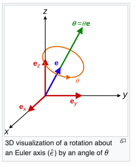

## Derivation of Uniform sampling in cone:

Given a cone with:

+ height $a$
+ base radius $b$
+ apes at origin
+ axis along the positive $y$ axis

Point at base center is $(0,a,0)$ and point at base rim is $(b,a,0)$. At height $h \in [0,a]$ above the apex the horizontal cross section is a circle. The con tapers linearly.

$$Radius ~at ~height ~h:~ r(h) = \frac{b}{a} h$$

This means that a slice at height $h$ is a disk of area:

$$A(h) = \pi (\frac{b}{a} h)^2 = \pi \frac{b^2}{a^2} h^2$$

Let $V(h)$ be the volume of the cone up to height $h$. Since the subcone is simlar to the entire cone the ratio of volumes equals the cube of the ratio of heights (since all linear dimensions scale with height):

$$\frac{V(h)}{V(a)} = \left(\frac{h}{a}\right)^3$$

Uniform Sampling of the volume thus means:

$$\mathcal{P}(H \leq h) = \frac{V(h)}{V(a)} = \left(\frac{h}{a}\right)^3$$

THis means that the distribution function for height is $H = a U^{1/3}$ where $U \sim \mathcal{U}(0,1)$.

For a given height $h$ the cross-section is a disk of radius $r_{max}(h)$. To sample uniformly inside a disk of radius $R$ we cannot sample $r \sim \mathcal{U}(0,R)$ since this overweights points near the center.

Disk area at radius $r$ is $A(r) = \pi r^2$. To make the area uniform we need:

$$\mathcal{P}(R \leq r) = \frac{A(r)}{A(R)} = \frac{r^2}{R^2}$$

Let $W \sim \mathcal{U}(0,1)$ then $R = R_{max} \sqrt{W}$.

## Uniform Sampling in Cylinder

Different to the cone, the cylinder has a height coordinate which is uniformly distributed

$$H \sim \mathcal{U}(0,a)$$

For the disk cross section at height $h$ the same logic as for the cone applies:

$$R = R_{max} \sqrt{W}$$

## Uniform Sampling inside of Sphere

For this we do this in spherical coordinates:

+ Draw $\phi \sim U(0,2\pi)$
+ Draw $u \sim U(-1,1)$ and set $\theta = \arccos(u)$
+ Draw $r = R \cdot U^{1/3}$ where $U \sim U(0,1)$

Convert this in Cartesian coordinates:
+ $x = r \sin(\theta) \cos(\phi)$
+ $y = r \sin(\theta) \sin(\phi)$
+ $z = r \cos(\theta)$

# Rotation Quaternions

In 3-D space according to Euler's rotation theorem any rotation can be described by a given angle $\theta$ around a fixed axis. The euler axis is usually represented by a unit vector $\vec{u}$

Quaternions give a simple way to represent this axis-angle representation using four real numbers. Euclidean vectors such as $(a_x, a_y,a_z)$ can be represented via $a_x i + a_y j + a_z k$ where $i,j,k$ are unit vectors representing the cartesian axes.

Any rotation of an angle $\theta$ around an axis is defined by the unit vector

$$u = (u_x, u_y, u_z) = u_x i + u_y j + u_z k$$

This can be represented by a unit quaternion $q$ since the quaternion product

$$(0 + u_x i + u_y j + u_z k) (0 - u_x i - u_y j - u_z k) = 1$$

we can derive using the Taylor series of the exponential function that:

$$q = cos(\frac{\theta}{2}) + u sin(\frac{\theta}{2})$$

It can be shown that the desired rotation can be applied to an ordinary vector $p = (p_x,p_y,p_z$ by representing the vector part of the pure quaternion $p'$ by evaluating conjugation by $p'$ and $q$:

$$L(p') = q p' q^{-1} = (0,r)$$

where $r = (\cos \frac{\theta}{2} - \sin^2 \frac{\theta}{2} ||u||^2) p + 2 \sin^2 \frac{\theta}{2} (u \cdot p) u + 2 \cos \frac{\theta}{2} \sin \frac{\theta}{2} (u \times p)$

Here $L$ is a linear transformation of the quaternion space to itself and since $q$ is unitary the transformation is an isometry. Also $L(q) = q$ and so $L$ leaves vectors parallel to $q$ invariant.

# Further literature

+ THis nice master thesis on the descriptors used for clustering 
https://helda.helsinki.fi/bitstreams/854bc939-7fe0-4e81-b426-deea91e37768/download

